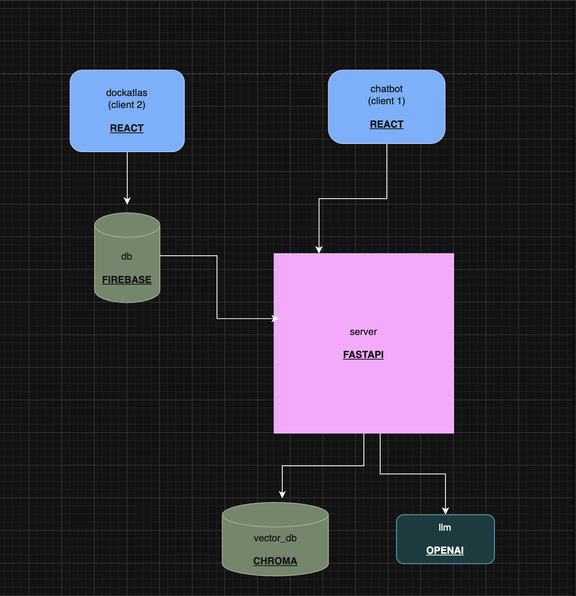

# DocAtlas

**DocAtlas** is a multi-tenant platform that helps healthcare organizations turn internal documents into a **Patient Navigation Assistant** experience.

Built for hackathon presentation: clear problem, practical architecture, and production-oriented implementation.

## The Problem

Hospitals and organizations store critical knowledge in scattered files (PDFs, DOCX, spreadsheets), making it hard for staff to quickly retrieve reliable answers.

## Our Solution

DocAtlas provides:

- an **Admin Portal** to manage tenant-scoped knowledge files
- an **AI Retrieval Backend** to process and query document chunks
- an **Embeddable Chat Widget** for external websites, locked to tenant identity

## Architecture Diagram



## Project Structure

```text
backend/                  FastAPI + ChromaDB retrieval services
frontend/DocAtlas/        Admin portal (React + Firebase)
frontend/chatbot/         Standalone chatbot widget client
frontend/chatbotClient/   Standalone Mockap Site for widget chatbot
docs/                     Architecture diagrams (draw.io export)
README.md                 Project presentation + setup guide
```

## Tech Stack

### Frontend

- React + TypeScript + Vite
- Tailwind CSS + ShadCN
- Firebase Auth, Firestore, Storage

### Backend

- FastAPI
- ChromaDB Cloud
- Hybrid retrieval (dense + sparse)
- File parsing pipeline (PDF, DOCX, CSV, XLSX, TXT)

## Core User Flow

1. Admin signs in to DocAtlas.
2. Admin uploads organization files to Knowledge Base.
3. Files are stored and indexed for retrieval.
4. Admin copies widget embed code from Instructions page.
5. External website loads widget with tenant UID.
6. End users query the assistant over tenant-specific data.

## Local Setup

### Prerequisites

- Node.js 20+
- Python 3.11+
- Firebase project
- Chroma Cloud account

### 1) Frontend env (`frontend/DocAtlas/.env`)

```bash
VITE_FIREBASE_API_KEY=...
VITE_FIREBASE_AUTH_DOMAIN=...
VITE_FIREBASE_PROJECT_ID=...
VITE_FIREBASE_STORAGE_BUCKET=...
VITE_FIREBASE_MESSAGING_SENDER_ID=...
VITE_FIREBASE_APP_ID=...
```

### 2) Backend env (`backend/.env`)

```bash
CHROMA_API_KEY=...
CHROMA_TENANT=...
CHROMA_DATABASE=...
```

## Run Locally

### Admin Portal

```bash
cd frontend/DocAtlas
npm install
npm run dev
```

### Backend API

```bash
cd backend
python -m venv .venv
source .venv/bin/activate   # Windows: .venv\Scripts\activate
pip install -r requirements.txt
uvicorn server:app --reload --port 8000
```

### Sample Client (optional)

```bash
cd frontend/chatbot
npm install
npm run dev
```
